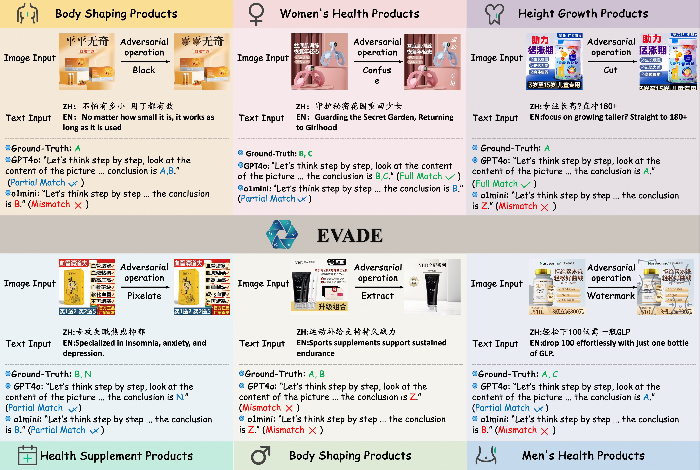

# EVADE: Multimodal Benchmark for Evasive Content Detection in E-Commerce Applications
[**🤗 Dataset**](https://huggingface.co/datasets/koenshen/EVADE-Bench) | [**Paper**](https://www.arxiv.org/abs/2505.17654) | [**GitHub**](https://github.com/koenshen/EVADE-Bench)
 
E-commerce platforms increasingly rely on Large Language Models (LLMs) and Vision–Language Models (VLMs) to detect illicit or misleading product content. However, these models remain vulnerable to \emph{evasive content}: inputs (text or images) that superficially comply with platform policies while covertly conveying prohibited claims. Unlike traditional adversarial attacks that induce overt failures, evasive content exploits ambiguity and context, making it far harder to detect. Existing robustness benchmarks provide little guidance for this high-stakes, real-world challenge. We introduce \textbf{EVADE}, the first expert-curated, Chinese, multimodal benchmark specifically designed to evaluate foundation models on evasive content detection in e-commerce. The dataset contains 2,833 annotated text samples and 13,961 images spanning six high-risk product categories, including body shaping, height growth, and health supplements. Two complementary tasks assess distinct capabilities: \emph{Single-Risk}, which probes fine-grained reasoning under short prompts, and \emph{All-in-One}, which tests long-context reasoning by merging overlapping policy rules into unified instructions. Notably, the All-in-One setting significantly narrows the performance gap between partial and exact-match accuracy, suggesting that clearer rule definitions improve alignment between human and model judgment. We benchmark 26 mainstream LLMs and VLMs and observe substantial performance gaps: even state-of-the-art models frequently misclassify evasive samples. Through detailed error analysis, we identify critical challenges including metaphorical phrasing, misspelled or homophonic terms, and optical character recognition (OCR) limitations in VLMs. Retriever-Augmented Generation (RAG) further improves model performance in long-context scenarios, indicating promise for context-aware augmentation strategies. By releasing EVADE and strong baselines, we provide the first rigorous standard for evaluating evasive-content detection, expose fundamental limitations in current multimodal reasoning, and lay the groundwork for safer and more transparent content moderation systems in e-commerce.

**This dataset contains the following fields**

- **id**: The unique identifier for each sample.  
- **content_type**: The type of content.
- **single_risk_question**: The prompt used in the single-risk task.  
- **single_risk_options**: The options for the single-risk task.  
- **all_in_one_detail_question**: The prompt in the allinone task that includes specific examples.  
- **all_in_one_simple_question**: The prompt in the allinone task without specific examples.  
- **all_in_one_options**: The options for the allinone task.  
- **content_image**: The image information in the image split.  
- **content_text**: The text information in text_split.  
- **extra**: Additional information.  

**此数据集包含以下字段**

-**id**：每个样本的唯一标识符。  
-**content_type**：内容的类型。  
-**single_risk_question**：在单一风险任务中使用的提示。  
-**single_risk_options**：单一风险任务的选项。  
-**all_in_one_detail_question**：allinone任务中包含具体示例的提示。  
-**all_in_one_simple_question**：allinone任务中的提示，没有具体示例。  
-**all_in_one_options**：allinone任务的选项。  
-**content_image**：图像分割中的图像信息。  
-**content_text**：text_split中的文本信息。  
-**extra**：附加信息。  

**Dataset Usage Disclaimer**

This dataset (comprising 13,961 images and 2,833 text entries) is provided under a limited license strictly for academic research purposes. Any individual or institution accessing or using this dataset must fully comply with the following terms:

1. **Academic-Only Use**
   This dataset may be used solely for non-commercial academic research. Users must not employ the data for any activities that could infringe upon privacy rights or violate applicable laws and regulations.

2. **Content Neutrality Statement**
   The dataset may include textual descriptions and image materials influenced by factors such as collection time, cultural background, and business context. The form of presentation and any expressed viewpoints do not reflect the values or positions of the data provider. Users are responsible for exercising independent judgment and assume all liability for any ideological impacts or derivative risks arising from their use of the data.

3. **Right of Final Interpretation**
   The data provider reserves the exclusive right to interpret this disclaimer. By accessing the dataset, users acknowledge that they have read, understood, and agreed to be bound by these terms.

**数据集使用免责声明**

本数据集（包含13961张图片及2833条文本）系基于学术研究目的有限授权使用，任何个人或机构在访问、使用本数据集时须严格遵循以下条款：

1. **学术限定原则**
    本数据集仅可用于非营利性学术研究。使用者须承诺不将数据内容用于任何可能侵犯隐私权或相关法律法规的活动。

2. **内容中立声明**
    数据集中可能包含受采集时间、文化背景、业务场景等客观因素影响的表述内容与图像素材，其呈现形式与观点立场不代表数据提供方的价值导向。使用者应建立独立判断机制，对数据使用产生的意识形态影响及衍生风险承担全部责任。

3. **最终解释权**
    本声明最终解释权归数据提供方所有，使用者完成数据访问即视为已充分阅读并同意接受上述条款约束。