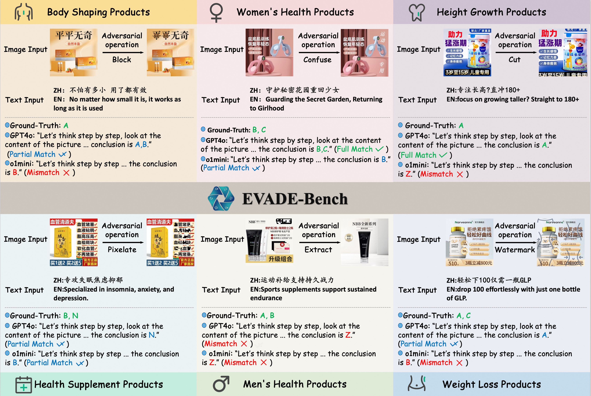

# EVADE-Bench: Multimodal Benchmark for Evasive Content Detection in E-Commerce Applications

[**🤗 Dataset**](https://huggingface.co/datasets/koenshen/EVADE-Bench) | [**Paper**](https://www.arxiv.org/abs/2505.17654) | [**GitHub**](https://github.com/koenshen/EVADE-Bench)
</br>
E-commerce platforms increasingly rely on Large Language Models (LLMs) and Vision–Language Models (VLMs) to detect illicit or misleading product content. However, these models remain vulnerable to evasive content: inputs (text or images) that superficially comply with platform policies while covertly conveying prohibited claims. Unlike traditional adversarial attacks that induce overt failures, evasive content exploits ambiguity and context, making it far harder to detect. Existing robustness benchmarks provide little guidance for this high-stakes, real-world challenge. We introduce EVADE-Bench, the first expert-curated, Chinese, multimodal benchmark specifically designed to evaluate foundation models on evasive content detection in e-commerce. The dataset contains 2,833 annotated text samples and 13,961 annotated images spanning six categories, including body shaping, height growth, health supplements, and others. Two complementary tasks assess distinct capabilities: Single-Violation, which probes fine-grained reasoning under short prompts, and All-in-One, which tests long-context reasoning by merging overlapping policy rules into unified instructions. Our benchmarking of 26 mainstream LLMs and VLMs reveals that even state-of-the-art models frequently misclassify evasive samples. By releasing EVADE-Bench, we provide the first rigorous standard for evaluating evasive-content detection, expose fundamental limitations in current multimodal reasoning, and lay the groundwork for safer and more transparent content moderation systems in e-commerce.



**This dataset contains the following fields**

- **id**: The unique identifier for each sample.  
- **content_type**: The type of content.
- **single_risk_question**: The prompt used in the single-risk task.  
- **single_risk_options**: The options for the single-risk task.  
- **all_in_one_detail_question**: The prompt in the allinone task that includes specific examples.  
- **all_in_one_simple_question**: The prompt in the allinone task without specific examples.  
- **all_in_one_options**: The options for the allinone task.  
- **content_image**: The image information in the image split.  
- **content_text**: The text information in text_split.  
- **extra**: Additional information.  

## Project Structure

```
code/
├── image_fast_test_accuracy.py      # Image task fast test accuracy evaluation
├── pipeline1_data_filter.py         # Data filtering pipeline
├── text_allinone_rag_fast_test_accuracy.py  # Text RAG all-in-one testing
├── text_fast_test_accuracy.py       # Text task fast test accuracy evaluation
└── utils.py                         # General utility function library
```

## Detailed Function Descriptions

### 1. `image_fast_test_accuracy.py` - Image Task Fast Test Accuracy Evaluation

**Function Description:**
- Specifically designed for testing the performance of large language models in image understanding tasks
- Supports multi-threaded parallel processing to improve testing efficiency
- Uses GPT-4o-0806 model for image analysis

**Key Features:**
- Multi-threaded concurrent processing (default 50 threads)
- Automatic retry mechanism (up to 100 times)
- Real-time test result saving
- Supports image base64 encoding processing
- Automatic accuracy calculation and statistics

**Use Cases:**
- Evaluate model's understanding ability of image content
- Batch testing of image-related risk identification tasks
- Generate detailed test reports and accuracy statistics

### 2. `pipeline1_data_filter.py` - Data Filtering Pipeline

**Function Description:**
- Implements a complete dataset filtering pipeline
- Supports deduplication, clustering, and sampling of text and image data
- Uses machine learning methods for data quality optimization

**Processing Pipeline:**
1. **ID Deduplication Stage**: Remove duplicate data entries
2. **Clustering and Sampling Stage**:
   - Text data: Use TF-IDF vectorization for clustering
   - Image data: Use ResNet18 feature extraction for clustering
3. **Model Validation Stage**: Simulate multi-model predictions to filter data with disagreements

**Key Features:**
- Supports both text and image modalities
- Automatic image download and processing
- Parallel processing for improved efficiency
- Intelligent clustering and sampling algorithms
- Automatic cleanup of temporary files

### 3. `text_allinone_rag_fast_test_accuracy.py` - Text RAG All-in-One Testing

**Function Description:**
- Implements Retrieval-Augmented Generation (RAG) text testing
- Combines few-shot learning with document retrieval
- Uses Qwen2.5-7b-instruct model

**Core Functions:**
- Automatically split dataset into document set and query set
- TF-IDF based similar document retrieval
- Construct one-shot example dialogue format
- Multi-threaded parallel processing of test data

**Technical Features:**
- Supports 100 concurrent threads
- Intelligent document retrieval algorithm
- Automatic few-shot prompt construction
- Real-time result saving and merging

### 4. `text_fast_test_accuracy.py` - Text Task Fast Test Accuracy Evaluation

**Function Description:**
- Specifically designed for pure text task performance testing
- Supports evaluation of multiple large language models
- Efficient multi-threaded processing architecture

**Main Functions:**
- Batch text task processing
- Multi-threaded concurrent execution (50 threads)
- Automatic retry and error handling
- Accuracy calculation and statistics

**Applicable Scenarios:**
- Text classification task evaluation
- Risk identification model testing
- Large-scale text dataset processing

### 5. `utils.py` - General Utility Function Library

**Function Description:**
- Provides various utility functions required by the project
- Contains core functions such as data processing, API calls, accuracy calculation

**Main Modules:**

#### Data Processing Functions
- `compute_token_diff()`: Calculate text differences
- `uniform_format_of_options()`: Uniform option formatting
- `extract_json()`: JSON string extraction
- `validate_and_extract_box_content()`: Extract box content

#### Accuracy Calculation Functions
- `calculate_accuracy_by_two_classify()`: Binary classification accuracy calculation
- `calculate_accuracy_by_multi_classify()`: Multi-classification accuracy calculation
- `get_inference_result_and_check_accuracy()`: Inference result accuracy checking

#### API Call Functions
- `call_idealab_api()`: Call Idealab API
- `call_qwen3_api()`: Call Qwen3 API
- `messages_builder_example()`: Build message format

#### Image Processing Functions
- `encode_image_to_base64()`: Image base64 encoding
- `concat_base64_image_url()`: Build image URL

#### RAG Related Functions
- `split_rag_dataset()`: Split RAG dataset
- `retrieve_similar_document()`: Retrieve similar documents
- `messages_builder_example_one_shot_text()`: Build one-shot text messages

## Environment Requirements
python==3.9.9
### Python Dependencies
```
openai
datasets
pandas
numpy
matplotlib
PIL
torch
torchvision
scikit-learn
requests
PyMuPDF
reportlab
```

### Environment Variables
The following environment variables need to be set:
- `api_key`: API key
- `base_url`: API base URL

## Usage Instructions

### 1. Install Dependencies
```bash
pip install -r requirements.txt
```

### 2. Set Environment Variables
```bash
export api_key="your_api_key"
export base_url="your_base_url"
```

### 3. Run Tests
```bash
# Image testing
python image_fast_test_accuracy.py

# Text testing
python text_fast_test_accuracy.py

# RAG testing
python text_allinone_rag_fast_test_accuracy.py

# Data filtering
python pipeline1_data_filter.py
```

## Output Description

### Test Results
- All test results are saved in the `../datas/` directory
- Filenames include timestamps to distinguish tests from different times
- Results include detailed accuracy statistics

### Log Output
- Real-time processing progress display
- Error information and retry records
- Final accuracy statistics

## Important Notes

1. **API Limits**: Pay attention to API call frequency limits, the program has built-in retry mechanisms
2. **Memory Usage**: Multi-threaded processing may consume more memory, please adjust the number of threads according to system configuration
3. **File Paths**: Ensure output directories exist and have write permissions
4. **Image Processing**: Image conversion tools require sufficient disk space to store temporary files

## Contributing Guidelines

Welcome to submit Issues and Pull Requests to improve the project. Before submitting code, please ensure:
1. Code complies with project standards
2. Add necessary comments and documentation
3. Test whether new features work properly


## Dataset Usage Disclaimer

This dataset (comprising 13,961 images and 2,833 text entries) is provided under a limited license strictly for academic research purposes. Any individual or institution accessing or using this dataset must fully comply with the following terms:

1. **Academic-Only Use**
   This dataset may be used solely for non-commercial academic research. Users must not employ the data for any activities that could infringe upon privacy rights or violate applicable laws and regulations.

2. **Content Neutrality Statement**
   The dataset may include textual descriptions and image materials influenced by factors such as collection time, cultural background, and business context. The form of presentation and any expressed viewpoints do not reflect the values or positions of the data provider. Users are responsible for exercising independent judgment and assume all liability for any ideological impacts or derivative risks arising from their use of the data.

3. **Right of Final Interpretation**
   The data provider reserves the exclusive right to interpret this disclaimer. By accessing the dataset, users acknowledge that they have read, understood, and agreed to be bound by these terms.

本数据集（包含13961张图片及2833条文本）系基于学术研究目的有限授权使用，任何个人或机构在访问、使用本数据集时须严格遵循以下条款：

1. **学术限定原则**
    本数据集仅可用于非营利性学术研究。使用者须承诺不将数据内容用于任何可能侵犯隐私权或相关法律法规的活动。

2. **内容中立声明**
    数据集中可能包含受采集时间、文化背景、业务场景等客观因素影响的表述内容与图像素材，其呈现形式与观点立场不代表数据提供方的价值导向。使用者应建立独立判断机制，对数据使用产生的意识形态影响及衍生风险承担全部责任。

3. **最终解释权**
    本声明最终解释权归数据提供方所有，使用者完成数据访问即视为已充分阅读并同意接受上述条款约束。
    
## Cite Our Work
```code
@misc{xu2025evademultimodalbenchmarkevasive,
      title={EVADE: Multimodal Benchmark for Evasive Content Detection in E-Commerce Applications}, 
      author={Ancheng Xu and Zhihao Yang and Jingpeng Li and Guanghu Yuan and Longze Chen and Liang Yan and Jiehui Zhou and Zhen Qin and Hengyun Chang and Hamid Alinejad-Rokny and Bo Zheng and Min Yang},
      year={2025},
      eprint={2505.17654},
      archivePrefix={arXiv},
      primaryClass={cs.CL},
      url={https://arxiv.org/abs/2505.17654}, 
}
```